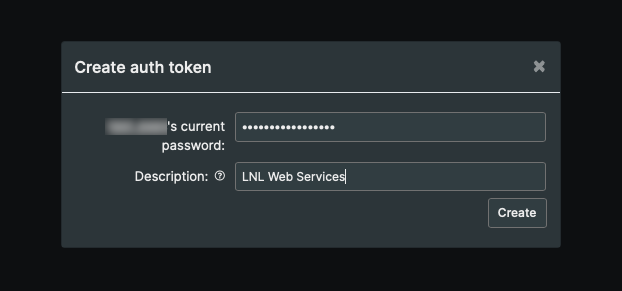
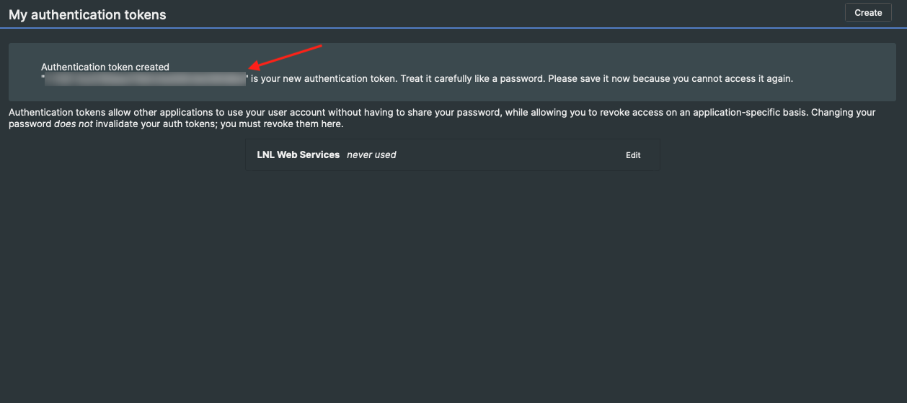

===========================================
Connect your RT account to LNL Web Services
===========================================

.. important::
    This guide is intended only for users with an existing RT account

The RT integration makes it possible to manage the TFed database through other LNL web services such as the LNLDB and
Slack. General users (without an account) can always submit tickets or comment on existing ones, however an account will
be required for just about everything else. Once linked, privileged users in RT will be able to modify ticket
information and perform other administrative tasks without the need to sign into RT directly.

Create an Auth Token
--------------------

In order to link your RT account with your LNL account, you'll first need to generate an **Auth Token**. Sign into RT
then select *Logged in as ...* > *Settings* > *Auth Tokens* from the menu bar.

.. note::
    If you do not see this option, then unfortunately you do not have the necessary permissions to use the RT
    integration.

In the top right corner of the page, click `Create`. In the dialog that appears, enter your password and a name for your
token. We recommend naming your token something like `LNL Web Services` so that it can be easily identified later.

Once you click `Create`, your token will appear in a message at the top of the page. Copy the token (the text that
appears between the quotation marks) and continue to the next step.

.. caution::
    **Remember:** Treat your token like a password and do not share it with others! Your token will only be displayed
    once.

Activate the RT Integration
---------------------------

.. raw:: html

    <a class="btn btn-primary" href="https://lnl.wpi.edu/support/connect/rt/">Activate</a>
      

Once you've generated an auth token, click the button above to start the setup process. When prompted, enter your token
then click `Submit`.

And that's it! Your accounts are now linked.

.. note::
    Changing your password does not invalidate your auth token. If you wish to unlink your accounts, log into RT and
    revoke the token.

`Last Updated: August 11, 2021`
