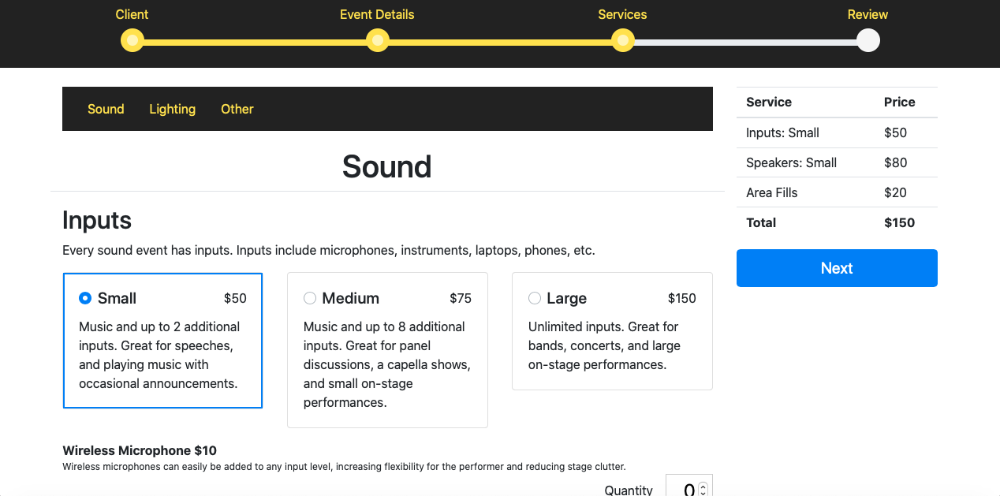
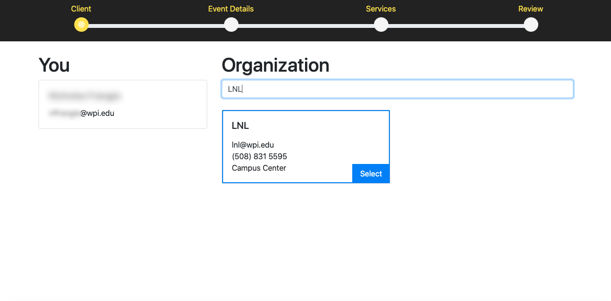
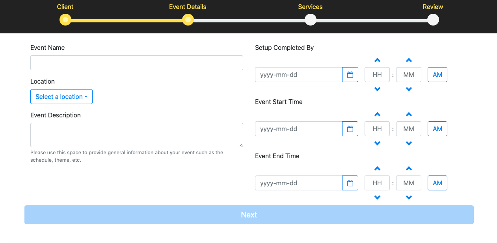
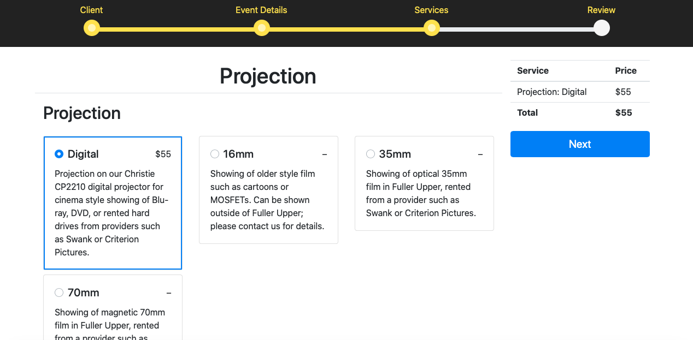

==============================================
Booking Your Event Online (Submit a Workorder)
==============================================

The workorder wizard is a fast and simple way for clients to book events through the LNLDB.

-----

Using the Workorder Wizard
--------------------------

To access the Workorder Wizard, visit `our website <https://lnl.wpi.edu>`_ and click `Workorder` in the top right corner.

1. You'll need to be logged in before you can access the Workorder Wizard. If you do not currently have an active
session, you'll be redirected to our login page automatically. If this is your first time using our website, select
`Sign in with Microsoft` then proceed to login with your WPI Microsoft credentials.

.. note::
    If you are not currently a member of the WPI community, `contact us <mailto:lnl-w@wpi.edu>`_ and we'll set up an
    account for you!

-----

2. Next you'll be presented with two options: `Create a lighting, sound, or power work order` or `Create a projection
work order`. Select the option that is most applicable for your event.

.. hint::
    Only select `Create a projection work order` if your event will take place in Fuller Upper. Select the option to
    `Create a lighting, sound, or power work order` for outdoor projection events.

-----

3. On the "Client" page, enter the name of your organization or department into the search field, then select the
corresponding option from the search results. If your organization is not listed, you will first need to :doc:`Create a
New Organization <new-organization>` through the LNLDB. Once you've selected your organization or department, the
Workorder Wizard will remember your selection for future visits.

-----

4. On the "Event Details" page, enter a name for your event, a location (if applicable) and a short description. You'll
also need to provide scheduling details such as when your event will need to be set up by, when it will start, and when
it will end.

-----

5. The next step will break down each of our services into categories and provide a short description explaining what
each service will offer. As you select items and services to add to your event, you'll see an itemized list detailing
the services that will be added to your event and their total cost.

.. note::
    You may receive various warnings based on the combinations of services you select. These warnings are meant to help
    you avoid selecting services that may be incompatible with each other or your event's location. However, if you
    still wish to continue, most of these warnings will not prevent you from doing so!

.. seealso::
    `Why we charge for events <https://lnl.wpi.edu/why-we-charge>`_

-----

6. Finally, once you’re done, click `Next`, and you’ll be brought to the review page. If everything looks as it should,
click `Submit`, and that’s it! Our Vice President will reach out shortly to confirm your event.

`Last Modified: April 21, 2021`
