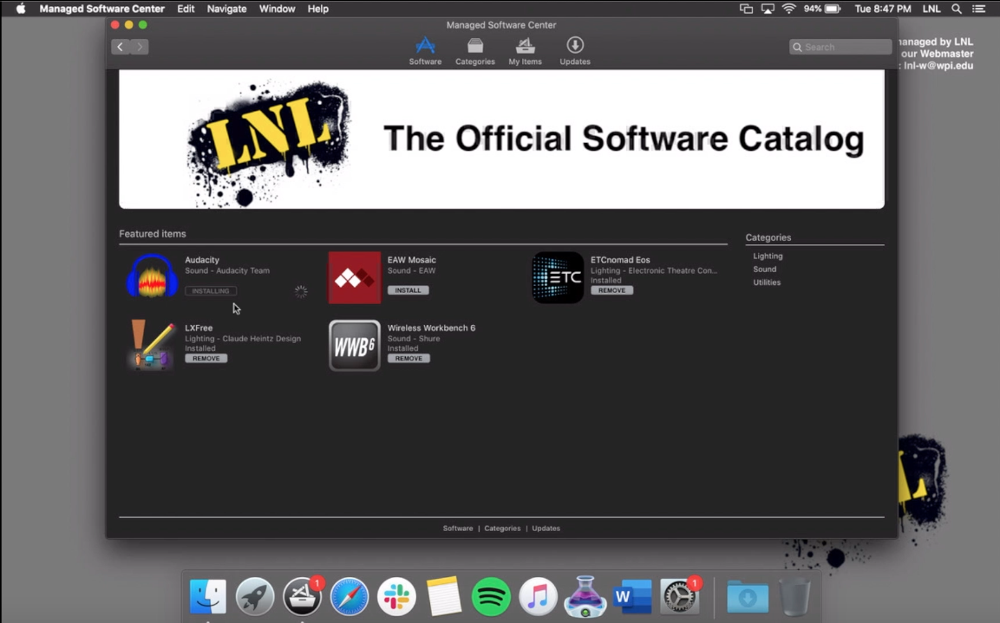

===================================
Installing Software on the MacBooks
===================================

The LNL MacBooks are managed through LNL’s own custom Mobile Device Management (MDM) platform. The MDM handles several
key functions related to the management of these computers including the upkeep of their software. If you are looking
to upgrade or install software on any of these devices, we highly recommend starting with the first approach outlined
below.

Managed Software Center
-----------------------

On each of LNL’s managed MacBooks you should find an application called the **Managed Software Center**. For your
convenience this application should already be pinned to the Dock. The Managed Software Center (MSC) is essentially
LNL’s own custom App Store where you can go to install software packages that have been approved and pre-configured by
the Webmaster. It’s based off an open source project called `Munki <https://www.munki.org/munki/>`_ which handles the
entire installation process for you. In fact, it allows you to install or update software without ever needing to enter
an admin password!

Whenever you are looking to install new software or update an existing application, we recommend checking MSC first. If
your desired software is not available in MSC, contact our Webmaster to request that it be added to our catalog.

.. tip::
    If you don’t see an application listed on the Featured tab in MSC, that doesn’t necessarily mean the software isn’t
    available. Be sure to check the respective category listings (i.e. Sound, Lighting, etc.) as well.

Requesting Software
-------------------
If you can't find your application in the Managed Software Center, you can send our Webmaster a request to
install the software for you. If you don't need the software installed immediately, this is the recommended approach as
it ensures your software will be set up properly and will remain on the device even after the device gets reimaged.

To request software, log into the LNLDB then select `Equipment` > `Laptops` from the navigation bar. Next click
`Request Software`, then `New App` and fill out the form that appears. Be sure to enter the full name of the application
and provide the name of the developer if you know it. Once your request has been approved by the Webmaster, the software
will be installed for you.

.. seealso::
    `Request Software <https://lnl.wpi.edu/mdm/apps/new/>`_

Installing Packages on Your Own (Not Recommended)
-------------------------------------------------

.. warning::
    When installing software on your own, there is no guarantee that the software will remain installed on the laptops
    after your event. If you wish to have the software remain installed, you will need to follow one of the methods
    above.

You may continue to install third-party applications on LNL’s laptops as you would any other MacBook. Although, by
default you will not have access to the Mac App Store. Use this approach *only as a last resort*. If the software
requires a license, contact the Webmaster.

`Last Modified: May 17, 2021`
