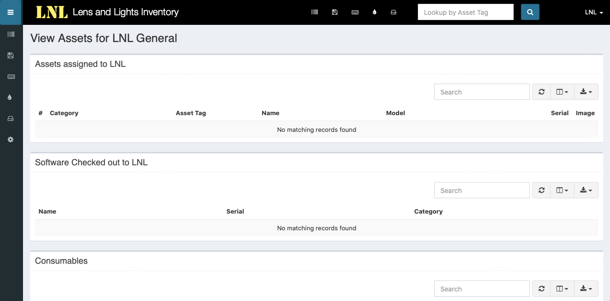

==========================
Getting Started with Snipe
==========================

Introduction
------------

Snipe IT is the system that LNL uses to track all the things we own. There are two main categories that items can fall
into within Snipe - **Assets** and **Accessories**. Assets are items that you want to track individually. All assets
must have a unique asset tag - that is how they are identified. Accessories are things that you want to track only as a
group. Accessories are very limited and should only be used for very small things or things that lack a good place to
put an asset tag.

To view LNL's inventory in Snipe, visit the `LNLDB home page <https://lnl.wpi.edu/db>`_ and select `Snipe` from the
Quick Links menu.

.. seealso::
    `Log into Snipe <https://lnl-rt.wpi.edu/snipe>`_

.. note::
    Only active members of LNL will have access to Snipe. If you do not already have an account in Snipe,
    `click here <https://lnl.wpi.edu/db/equipment/snipe/>`_ to obtain login credentials. Access will be read-only.

Once you are logged in, you can view assets, by selecting `Assets` > `List All` from the sidebar. You can now search
for specific items using the search field on this page. Use this search field when searching for items, as the one at
the top of the page only conducts searches using asset tags.

If for example you want to find out how many Source 4s we own, select `Assets` > `List All`, then search for “source 4".

-----

Rentals
-------

The LNLDB has a helpful tool to make checking equipment in and out much easier. Simply scan the asset tags for each of
the items you wish to check in or out and let Snipe take care of the rest!

Checkout
^^^^^^^^

Select `Equipment` > `Inventory Checkout` and follow the instructions on the page. To scan an asset tag, point the
barcode scanner at the tag and pull the trigger. The scanner should add a carriage return automatically. For
accessories, there are special barcodes located in the lids of bins or the drawers of workboxes. Scan accessory barcodes
multiple times for the number of items you are checking out.

Checkin
^^^^^^^

The checkin process is essentially the same as the checkout process. Select `Equipment` > `Inventory Checkin` and follow
the instructions on the page.

.. note::
    If you are doing one-off checkins or checkouts you can do it in Snipe. Just locate the asset and click
    checkin/checkout then select the user.

Need to add a Rental Client?
^^^^^^^^^^^^^^^^^^^^^^^^^^^^
If the rental client isn't listed in the dropdown, contact our `Technical Director <mailto:lnl-td@wpi.edu>`_ for
assistance.

`Last Modified: May 17, 2021`
