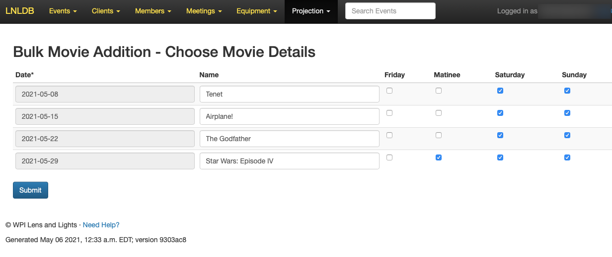

==================================
Creating Projection Events in Bulk
==================================

The LNLDB includes a neat little tool designed to help the Head Projectionist schedule several movies at once over a
given time period. This feature is typically used to add the upcoming weekend movies for the coming term or semester all
at once.

.. caution::
    **Permission Required:** Create projection events in bulk

    In order to use this tool, you must have been assigned a role that allows you to add new movies to our event
    schedule in bulk. If you do not see the option to `Bulk Add Movies` under `Projection` in the navigation bar, your
    current role(s) do not grant you adequate permission.

Schedule Movies in Bulk
-----------------------

.. hint::
    This process is optimized for scheduling movies on recurring weekends (Fridays, Saturdays and Sundays). For
    individual projection events, or events taking place on weekdays, we recommend creating a new event as defined
    :doc:`here <event-details>`.

To get started, navigate to `Projection` > `Bulk Add Movies`. Then follow the steps below.

Step 1
^^^^^^

On the first page you will be asked to provide some basic information about the collection of movies you are about to
add.

- **Contact:** Type the name of the person who will serve as the event contact for these movies. As you type, the field
  will automatically search our database and display a list of users matching your query. Select the desired person from
  the search results to continue.
- **Billing:** Enter the name of the organization that will be billed for these events (AKA the client). Like the
  `Contact` field, this field will search our database for a matching organization as you type. Select an option from
  the results to continue.
- **Date of first movie:** Enter the planned date for the first movie in the series. You may either use the included
  calendar widget or enter the date manually in ``mm/dd/yyyy`` format.
- **Date of last movie:** Enter the planned date for the final movie in the series. You may either use the included
  calendar widget or enter the date manually in ``mm/dd/yyyy`` format.

.. hint::
    There must be at least one Saturday between your selected start date and end date (inclusive). The form will
    determine how many weekends to create events for based off of the number of Saturdays in your date range.

Once you have filled out the form, click `Continue`.

Step 2
^^^^^^

You should now be presented with a form containing several rows - one for each weekend in the date range you specified
in Step 1. In each row, enter the name of the movie that will be showing that weekend and select the desired showing
times. The possible showing times correspond to the following time frames:

- **Friday:** Friday from 8 - 11 PM
- **Matinee:** Saturday from 2 - 5 PM
- **Saturday:** Saturday from 8 - 11 PM
- **Sunday:** Sunday from 8 - 11 PM

.. note::
    There is no need to adjust the dates in the first column. Leave these fields as they are.

Once you have listed all of the movies you wish to add for the given time period, click `Submit`. You should then see a
summary of all the movies that have been added to the database. Clicking on any of these links will take you directly to
the corresponding event detail page.

`Last Modified: May 6, 2021`
