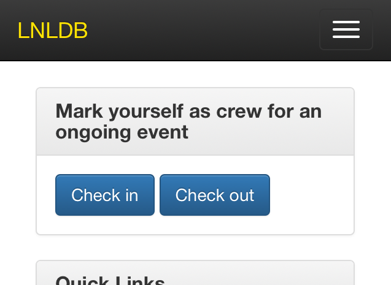
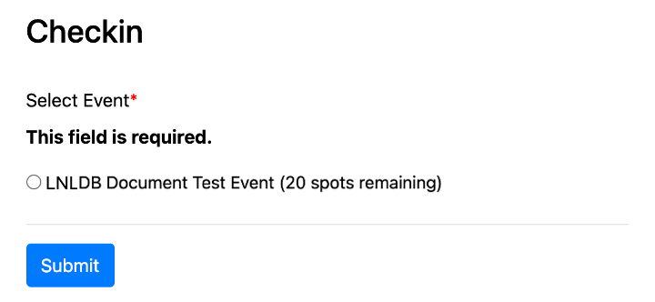
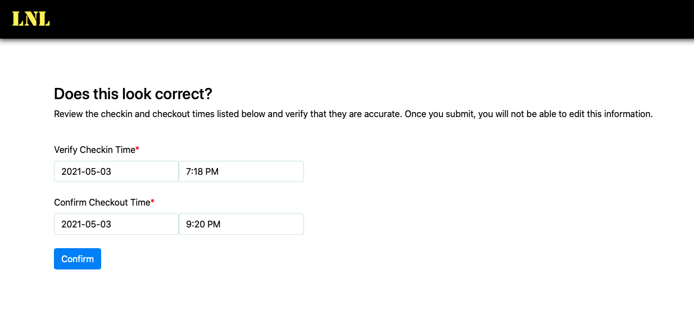
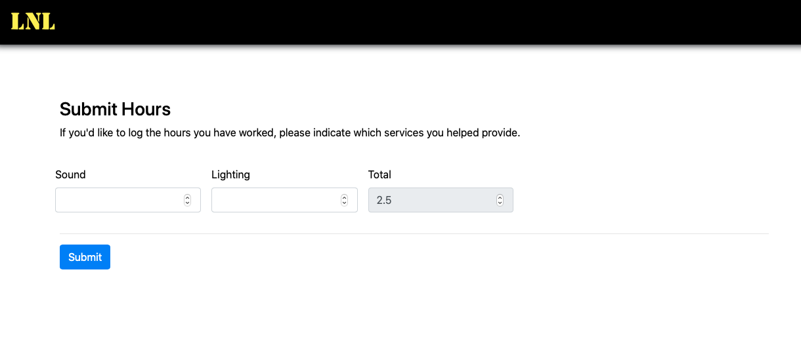
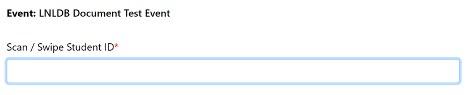

======================
Checking into an Event
======================

In order to obtain credit for both gaining and maintaining active membership, LNL has an electronic system for keeping
track of the events members attend. Members are expected to check in when they arrive at the event and check out when
they leave the event.

You may check into an event beginning at the event’s setup start time and may check out of an event as late as five
hours after the event’s end time.

-----

Navigating to the Checkin / Checkout Page
-----------------------------------------
Mobile
^^^^^^

To check in and out of an event on a mobile device, you can use the `Check In` and `Check Out` buttons located on the
home page of the LNLDB. Alternatively, you may navigate to `lnl.wpi.edu/crew <https://lnl.wpi.edu/crew>`_.

Desktop
^^^^^^^

To check in and out of an event from desktop, navigate to `lnl.wpi.edu/crew <https://lnl.wpi.edu/crew>`_.

-----

Checkin
-------

From the Checkin menu, you must select the event you wish to check into using the radio buttons. Then, click `Submit`
to check into the event.

-----

Checkout
--------

After clicking on the `Check out` button, verify the hours you were at the event.

Then enter the amount of time you spent assisting within each service category.

.. note::
    The LNLDB will round to the nearest 15 minutes

-----

Using the Bulk Checkin Feature
------------------------------

To open the bulk checkin tool, visit `lnl.wpi.edu/crew <https://lnl.wpi.edu/crew>`_ then click `Open Bulk Checkin`.
Once you've selected your event, ensure that the entry field is in focus and begin checking people in.

To check someone in or out, simply scan or swipe their student ID. If a match is found in our system, their checkin
status will be toggled automatically. This means that once a crew member has checked in, all they need to do to check
out is scan or swipe their card again (and vice versa).

.. note::
    To launch this page you will need to be listed as a crew chief for an ongoing event

.. hint::
    If you get an `Invalid ID` error, this means that the crew member's student ID is not listed in their profile.

`Last Modified: May 3, 2021`
