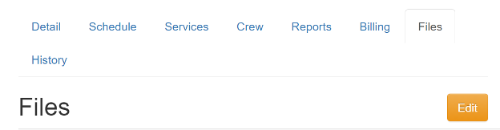
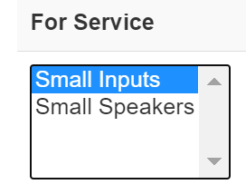
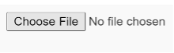
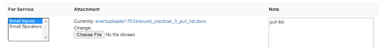

========================
Upload Event Attachments
========================

Clients
-------
In addition to the information we may have collected from you when booking your event, it may sometimes be necessary to
share additional attachments and/or media files with us to help us better provide our services to you. These
files can be just about anything ranging from floorplans to MP3 files containing audio tracks to be played during a
performance. This guide will provide step-by-step instructions explaining how to upload these files for your event.

Crew Chiefs
-----------
As a crew chief one of your responsibilities is to plan out how you will set up the systems that will run your event.
These plans sometimes rely on various files such as pull lists and/or lighting plots. This guide will provide an
overview of how you can upload these files for future reference so that you and others may benefit from these resources.

-----

Upload Files for an Event
^^^^^^^^^^^^^^^^^^^^^^^^^

1. First, navigate to the event detail page in the LNLDB. In other words, visit `lnl.wpi.edu/db <https:lnl.wpi.edu/db>`_
then use the `Events` navigation menu to find the event.

2. Once on the event detail page, click on the `Files` tab then click the yellow `Edit` button.

3. Select the service(s) the file applies to (if any). If you're unsure, feel free to leave this field blank.

4. Next click the `Choose File` button. A popup will appear prompting you to select a file from the local file system on
your computer.

5. Once the file has been selected, use the `Note` field to provide a brief description of what the file is.

6. When you are done uploading all of your files, scroll down to the bottom of the page and click `Save Changes`.

And that's it! Your files are now available on your event page.

`Last Modified: April 23, 2021`
