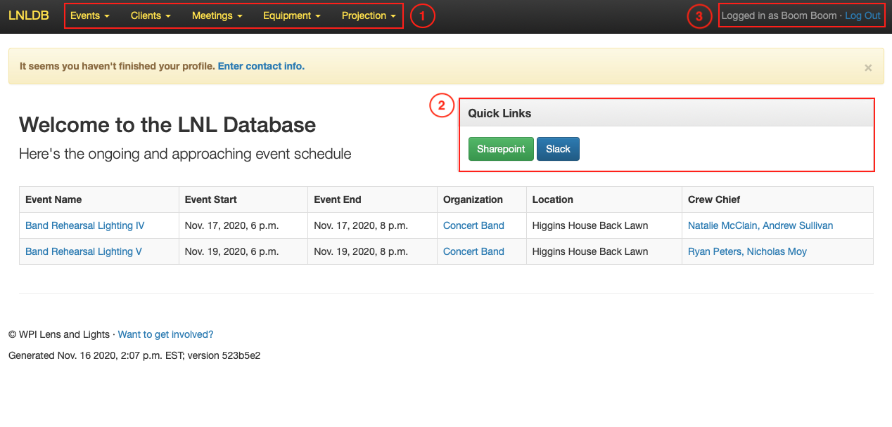

===============
Getting Started
===============

To get started visit our website at `lnl.wpi.edu <https://lnl.wpi.edu>`_ and click `My Account` in the top right corner.
Next select `Sign in with Microsoft` and log in with your WPI Microsoft account.

Navigating the Site
===================

To navigate the LNLDB, select a menu item from one of the dropdowns (1). LNL members can also find Quick Links to some
of our more commonly used services in the Quick Links menu on the homepage (2). If you ever need to return to this
page, click `LNLDB` in the top left corner.

Additionally, you can update your profile or log out of your account at any time using the respective links in the top
right corner (3).

.. note::
    LNL members have the ability to search for events using a search field located in the navigation bar. However, in the near future, this will likely be replaced by a newer and more expansive search tool.

Quick Links
-----------

Depending on your level of involvement with LNL the following Quick Links may be available to you:

+------------+------------------------------------------------+--------------------+
| Item       | Description                                    | Available to       |
+============+================================================+====================+
| Sharepoint | Used for file storage (documents, photos, etc) | All LNL members    |
+------------+------------------------------------------------+--------------------+
| Slack      | Communicate with other LNL members             | All LNL members    |
+------------+------------------------------------------------+--------------------+
| Snipe      | LNL's equipment inventory management system    | Active LNL members |
+------------+------------------------------------------------+--------------------+
| RT         | LNL's ticketing system for tracking repairs    | Executive Officers |
+------------+------------------------------------------------+--------------------+

Where to Find Help
==================

If you're struggling to find a particular page or would like to learn more about a particular feature, be sure to check
out our :doc:`User Guides <user-guides>`. You can also find Help buttons located throughout the LNLDB.

.. seealso::
    Something not working correctly? Let us know by :doc:`submitting a bug report <report-bugs>`.
