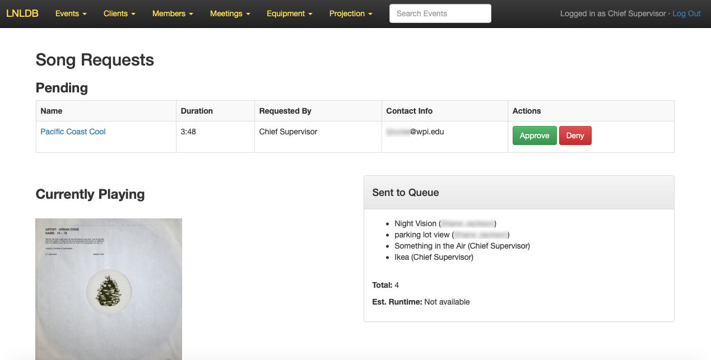
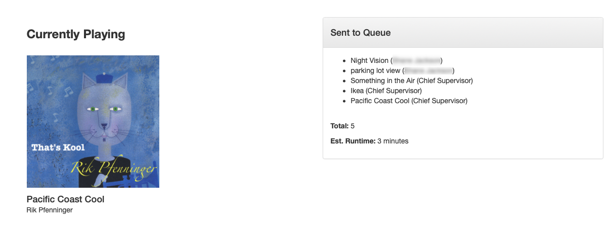

==============================
Accept Song Requests (Spotify)
==============================

The LNLDB leverages the Spotify Web API to make it super easy to collect and queue song requests for events like Wall of
Sound. This guide will explain how you can set up a new song request session for your event and how you can configure it
to fit your needs.

-----

Create a New Session
--------------------

Song requests can be enabled for any event that has been approved and has not yet been reviewed. To get started, you'll
need to create a new Spotify session on the event detail page.

.. image:: ../../_static/img/spotify/new.png
    :align: center
    :width: 100%

#. Navigate to the event detail page for the specific event you would like to collect requests for.
#. Select the `Apps` tab and look for the `Spotify` applet.
#. Click the `New Session` button.
#. Fill out the form, then click `Save Session`. To learn more about the options presented in this form, check out
   :ref:`session-settings` below.

Your session is now ready to go. Once you have returned to the event page, you'll be presented with a link to the page
where your event guests will be able to make their requests.

.. caution::
    **Permission Required:** Create a Spotify session

    In order to create a new session, you must have been assigned a role that gives you permission to do so for a given
    event. By default, only Officers and the event's Crew Chiefs will have this permission. If you do not see the
    Spotify applet under the `Apps` tab on the event detail page, then your current role(s) do not grant you adequate
    permissions to perform this action.

.. tip::
    To make sharing your link easier, the LNLDB can also generate a QR code for you. Just click `QR Code` to display or
    download the code.

-----

.. _session-settings:

Update Session Settings
-----------------------

You can view or manage the configuration of your song request session at any time from the Spotify applet on the event
detail page.

.. caution::
    **Permission Required:** Update a Spotify session

    In order to edit a session, you must have been assigned a role that gives you permission to do so for a given event.
    By default, only Officers and the event's Crew Chiefs will have this permission. If you do not see the
    `Configure Session` button in your Spotify applet, then your current role(s) do not grant you adequate permissions
    to perform this action.

#. Navigate to your event's detail page and select the `Apps` tab.
#. In the Spotify applet, click the `Configure Session` button. This will take you to the same form you filled out when
   you created the session.
#. Make the desired changes, then click `Save Session`.

An overview of each of the settings is outlined below:

- **Spotify Account**: The Spotify account that will be used for this event. Tracks submitted to this session's queue
  will play on whatever device this user is currently logged into.
- **Accepting requests**: If this is enabled, you're ready to accept song requests. To stop accepting song requests,
  simply uncheck this box. You can come back and toggle this setting on or off at any time.
- **Allow explicit**: By default, we allow guests to request explicit music. If you would prefer not to allow this,
  uncheck this box.
- **Automatically approve requests**: If you don't particularly care what ends up on your queue, you can select this
  option to allow the LNLDB to automatically attempt to queue requests as they come in.
- **Restrict to LNL members**: Check this box for a private session. Users will need to be logged in to request songs.
- **Require payment**: If donations are required to make a request (i.e. Wall of Sound), check this box.
- **PayPal.Me Link**: If you are collecting donations using PayPal, paste your PayPal.Me link here. If you do not have
  one, you can always create one for free.
- **Venmo**: If you are collecting donations using Venmo, enter your Venmo username.
- **Venmo verification**: Venmo occasionally asks users to verify that they are sending money to the correct person. To
  ensure that users can complete this step, you should enter the last 4 digits of your phone number here if you are
  collecting donations through Venmo.

-----

Manage Song Requests
--------------------

As requests come in, you may need to approve and/or queue each individual request. For events where donations are
collected, the LNLDB also allows you to keep track of which users have paid the fee. If you have the necessary
permissions, you'll see the relevant buttons appear in the table as needed.

.. caution::
    **Permission Required:** Approve Song Requests

    To manage song requests, you will need to have been assigned a role that gives you permission to approve song
    requests for a given session. By default, only Officers and the event's Crew Chiefs will have these permissions. If
    you do not see any buttons on the requests page, then your current role(s) do not grant you adequate permissions to
    manage song requests.

New requests will appear at the top of the page. If the requests aren't automatically approved and queued, then you will
be presented with options to `Approve` or `Deny` the request. To learn more about the requested track, you can always
click on its name to open it in Spotify.

Once a track has been approved, if payment is required, you'll be asked to confirm that the request has been paid for.
If payment is not required, you'll instead see the `Queue` button. Click this to attempt to add the track to the queue
in Spotify.

.. note::
    If Spotify is not currently active on any of our devices, you'll likely get an error when attempting to queue
    tracks. All you will need to do is launch Spotify and start playing something on the device you intend to use. Just
    make sure you are using the same Spotify account you selected when configuring the session!

If all goes well, you should be able to see all of your queued tracks in Spotify. In addition to the list of pending
requests, the LNLDB will also show you a list of all the tracks you have added to the queue during your session as well
as the track currently being played (if applicable). The LNLDB will do its best to estimate the approximate runtime of
your queue, although if you add tracks to the queue from within Spotify itself, the LNLDB may not be able to accurately
account for the additional time.

.. tip::
    Make sure to refresh the page from time to time as new requests may have come in!

`Last Modified: February 27, 2022`
