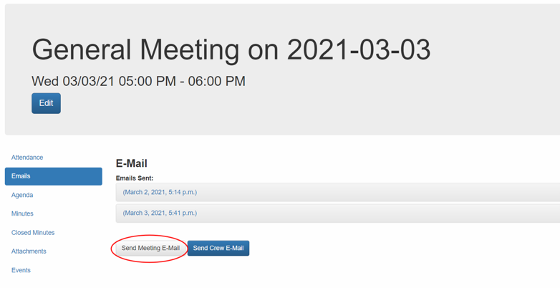
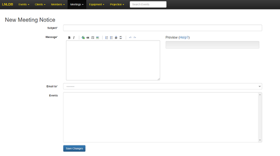

===========================
Send a Meeting Notice Email
===========================

Once a meeting has been created (see :doc:`Create or Edit a Meeting <meeting-details>`), you can send out meeting
notifications. This is often used by the Secretary to send meeting notices to the club.

.. caution::
    **Permission Required:** Modify Meeting Details

    In order to create new meetings or send meeting notices, you must have been assigned a role that allows you to
    modify meeting records. If you do not see the option to create a new meeting under `Meetings` in the navigation bar,
    your current roles do not grant you adequate permission.

**To send a meeting notice for a specific event:**

1. Start by logging into the `LNLDB <https://lnl.wpi.edu/db>`_, then click `Meetings` > `View Meetings`.
2. Select the meeting you wish to send a meeting notice email for.
3. On the page that appears, select `Emails` from the sidebar. This will list all of the emails that have been sent
   for this meeting.

4. Click `Send Meeting E-Mail` and begin filling out the form.

   - **Subject:** This will be the subject line of your email (i.e. `"LNL General Body Meeting"`)
   - **Message:** This will be the body of your email. Ensure that your message contains all of the necessary meeting
     details such as when the meeting will take place and how to get there (if applicable).
   - **Email to:** Select the email alias you wish to send the meeting notice to.
   - **Events:** `You may skip this field`

5. Once you are satisfied with the details, click `Save Changes`. The LNLDB will then send your email and take you back
   to the previous page.

.. tip::
    To the right of the `Message` field, the LNLDB will show you a preview of the body of your email. The LNLDB uses
    Markdown for formatting and will display the result in realtime. To learn more about the Markdown formatting
    options available to you, click the blue `Help?` button located above the preview box.

`Last Modified: May 17, 2021`
