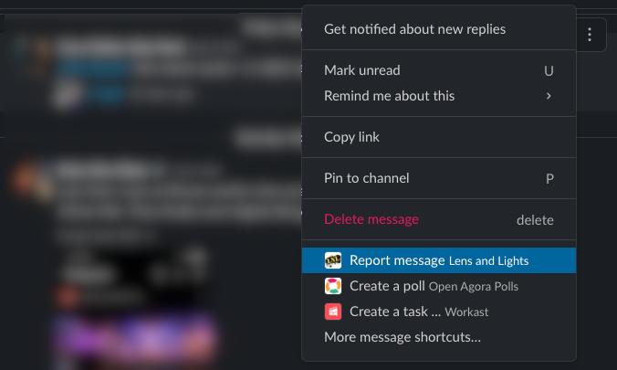

======================
Report a Slack message
======================

If you come across a message in Slack that you feel violates WPI's Acceptable Use Policy, offends you, or contains
sensitive information that should not be shared, you can report the message to LNL's Webmaster.

Report a Message
----------------
1. Open Slack and navigate to the message you would like to report.
2. Hover over the message and select the *More actions* option (three vertical dots).
3. Select `Report message` from the menu.

4. You'll be presented with the option to provide any additional comments you would like to include in your report.
5. When you're ready, click `Submit`

What happens next?
------------------

The Webmaster will review your report and take the appropriate action to resolve the situation. This may involve
editing or deleting the offending message and in some cases may even result in disciplinary action.

.. seealso::
    `WPI Acceptable Use Policy <https://www.wpi.edu/about/policies/acceptable-use>`_

`Last Modified: December 7, 2021`
